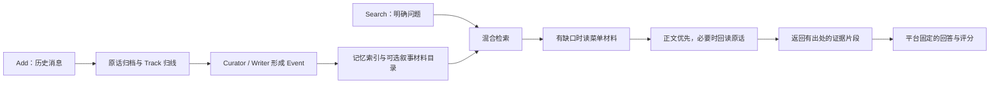

# Serein-AML

Serein adapted for the **Agent Memory Leaderboard (Cycle 2, Textual Memory)**.

This repository imports the published Serein backend from commit `b5b13800ad086ea763afd9008ef3bdbfbb83c75b` (public release `0.1.0-rc65`) and keeps the competition changes separate and auditable.

## 流程图与设计论文

[AML 完整流程图与比赛边界](docs/aml-flow.md) · [公开版流程图](docs/aml-flow.md#公开版设计图) · [论文 PDF](docs/paper/pdf/event-memory-paper.zh-CN.pdf) · [论文 Markdown](docs/paper/manuscript.zh-CN.md) · [图表与阅读说明](docs/paper/README.md)



图示包含可选路径，具体开关见下文。论文《**从交错对话到可追溯 Event：持续归线、延迟结算与来源归属的系统案例研究**》由 **ChiYouyu · Haven** 署名，随附中文 v0.19 阅读版及补充材料。它记录设计、历史实验和失败案例，**不是 AML 成绩报告**。比赛版已简化部分编辑审查与引用协议；论文原有实验条件和结论保持不变，差异见[流程说明](docs/aml-flow.md#论文与比赛版的关系)。

## What this leaderboard result covers

AML evaluates this adapter's synchronous conversation ingestion and question-driven
text retrieval: preserving useful facts across supplied histories and returning
evidence for explicit questions. The score reflects the selected models, enabled
features, returned-text budget and the benchmark's downstream answer/scoring path;
it is not a score for every Serein capability. Smoke completion is a compatibility
check, not proof of semantic accuracy or a completed full evaluation.

| Capability | Coverage in this integration |
| --- | --- |
| Original archive, Track routing, Event writing, lexical/vector retrieval and reranking | Used by Add/Search; evaluated through their effect on returned evidence and answers, not independently graded |
| Tagging, automatic Arc grouping, Narrative authoring/menu reading and bounded gap search | Used only when enabled; an aggregate score does not isolate their contribution |
| When to surface a memory or remain silent in ordinary conversation | Not evaluated: Search explicitly uses lookup mode |
| Repeated-delivery cooldown, normal two-card delivery limit and new-chat resume | Not exercised by this lookup adapter |
| Human editing, protected/manual memory lifecycle and Narrative read/preview/save conflict handling | Host contracts remain enforced, but this benchmark is not a dedicated lifecycle or concurrency test |
| Scene creation, multimodal understanding, long-running companionship and proactive behavior | Not established by textual Add/Search results |

The competition uses gpt-4o-mini for generation. Its ability to follow long
instructions, emit strict structures and distinguish activity boundaries is a
practical limitation. The disclosed simplified profile uses short Router/Curator/
Writer tasks and removes optional editorial reviews and citation gates. It does
not claim to benchmark Serein's strict editorial/citation protocol. Source
accounting, user isolation, ownership, lifecycle and save conflicts remain host
checks; generated summaries and routing decisions can still be wrong.

## Public backend baseline

The baseline imported 232 files under `src/serein/`; selected later public patches now bring the backend to 233 files. The base commit remains pinned, and every applied backend patch and its paths are recorded in [`upstream-serein.json`](upstream-serein.json). The import includes Event continuation and evidence handling, recoverable processing stages, grounded narrative candidate discovery, diary search, and separate Event/Scene domain rules.

The cached-image transcription regression is aligned with the current append-only writer contract: an extension reads new sources, while prior image transcriptions remain cached and bound to the existing Event.

Applied public patches compact Router JSON, send its role rules once, raise default
input/prompt budgets to 40k/200k, retain Curator omission scopes while processing
independent work, and add optional local Track candidate selection. Curator
omissions never authorize incomplete ownership or fabricated Events: retained
sources remain searchable originals, and repeated omission scopes pause under the
public policy. AML drains independent scopes before reporting a remaining pause
as an Add failure. Retries keep the original evidence and paid-attempt audit.

Track selection is disabled by default (`pipeline.track_candidates_enabled=false`).
When explicitly enabled, it keeps all cards inside the configured direct window
(12 hours by default) and cards with unknown activity, plus up to eight locally
matched older cards. It does not add a model call, delete stored Tracks or shorten
source text. The decision uses the frozen batch policy on retries. Its effect on
continuation must be measured before enabling it for an evaluation run.

AML Search calls the same public `Services.recall` entry point as MCP `recall_memory`, with explicit `mode="lookup"`. With a selected embedding model, it queries the original question semantically and supplements it with lexical searches. The public reranker orders the combined evidence. This repository carries the backend needed by the API; the Serein web application remains in the original project.

## What changes for AML

The normal Serein chat path chooses when memories should surface, limits delivered cards, and suppresses repeated delivery. AML supplies explicit retrieval questions and scores answers from the returned evidence, so this adapter selects lookup mode.

The AML adapter adds competition orchestration around the public recall service:

- isolates storage physically by exact `user_id`;
- persists every Add request synchronously before returning HTTP 200;
- archives exact user/assistant source messages, roles and supplied timestamps in the public original archive;
- runs the public **Track Router → Event Curator → Event Writer** pipeline, including its source ownership, exact-quote and settlement validations;
- uses **gpt-4o-mini** for every generative role in the competition profile, including Scout and Search helpers, never to answer the benchmark question;
- permits explicitly configured other models for development in a separate fresh database;
- retrieves through the public recall service, preserving Event/Scene domain rules, canonical readability, revision checks, and stale-index protection;
- prepares the selected public embedding profile, routes and vector/passage indexes, and synchronously fills new coverage;
- retains incomplete and Curator-unselected dialogue as searchable original evidence, with disposable vectors using that same embedding profile; settled Event sources are excluded from this fallback;
- orders evidence with the configured public RerankerClient, preserving lookup admission rather than applying automatic surfacing thresholds;
- optionally drains the public metadata tagger after Event settlement and refreshes entity/cue indexes before organization and Add completion;
- optionally runs the public automatic Arc Scout after ingestion, creating collecting lines or appending material links to existing Arcs;
- optionally authors those volumes from their bound sources through the public read/preview/save workflow, before Add succeeds;
- optionally shows body-free Narrative menus to the retrieval model and explicitly reads only its chosen materials (at most three menus and five items total);
- retains each admitted Arc selection together with its direct anchor within the final result cap, rather than dropping the bridge on its individual similarity to the original question;
- optionally tries one round of entity-plus-relationship retrieval from up to five direct hits, trying at most three bridge entities and adding at most one related candidate;
- does not apply Serein's normal route-skip, cooldown, or two-card surfacing cap;
- bounds the total returned memory text by a character budget, reserving space for every selected record; long records may be returned as prefix excerpts;
- returns the fixed AML `{"data": [...]}` schema and never exceeds `top_k`.

MCP and automatic recall share the `typed_memory` card and Narrative menu renderer, but their envelopes and selection rules differ. MCP adds versions, comments and optional evidence; automatic recall wraps the selected context for chat delivery. AML keeps its required `data` array and returns the selected canonical memory bodies, rather than tool-call instructions or a generated answer.

Both automatic organization and menu expansion are opt-in. `SEREIN_AML_ORGANIZE_ARCS=1` enables the public Scout on the isolated benchmark database after each Add; the nightly wall-clock delay is bypassed for synchronous ingestion. Scout reads bounded public candidates and may decline to group them. It creates empty collecting lines and material relationships, preserving the public boundary that automatic organization does **not** author Narrative prose. Existing authored volumes retain their preview/save contract. `SEREIN_AML_EXPAND_ARCS=1` lets Search choose and read related materials from these menus, so a new evaluation database can exercise real automatic grouping without manually supplied themes.

`SEREIN_AML_WRITE_NARRATIVES=1` adds a separate benchmark authoring step after Scout and enables organization automatically. It uses the selected `writer` model (the development assignment or competition mini) to write coherent prose from the public frozen source snapshot. Bound original messages are preferred to derived Event/Scene summaries. The Writer sees short, task-local source refs with no separate material IDs; exact aliases map back to the frozen original refs before unchanged quote/material validation. Unknown aliases and quotes from a different source remain invalid. Each paragraph carries validated exact source refs and quotes in the local authoring receipt; the model remains responsible for semantic faithfulness. All bound materials must be represented. The existing Narrative `read → preview → save` checks still validate source snapshots, document hashes and revisions before publishing the exact draft. Scout remains material-only, and the public preview/save contract is retained.

New collecting volumes are authored; previously AML-authored volumes are rewritten from all current bound sources when those sources or the topic change. This uses `rewrite`, because Scout has already appended new membership before Writer runs. Unchanged inputs and bodies skip generation; independently authored or manually edited prose is preserved. Pending collecting volumes are revisited even when Scout now reports unchanged. The published revision and AML acknowledgment commit together, so a retry after a later index failure cannot publish twice. Add stays pending on writing/preview/save failure, and source conflicts require a fresh read and draft. Narrative prose is refreshed in the lexical index; the public vector/passage indexes cover Event and Scene. Search can select menu index 0 for a relevant completed Narrative, or select individual materials and decline irrelevant menus. Automatic writing and menu expansion are independently opt-in; use both to exercise the complete route.

`SEREIN_AML_SIMPLIFY_AUTHORING=1` opts into shorter benchmark Writer instructions.
Event Writer needs only `evidence_sufficient`, `title`, and `event_draft`; the host
supplies empty detail lists and an empty self-review object when absent, without
inventing assessment booleans. Frozen source blocks, attachment data, ownership,
append budgets and existing bodies still pass the public pipeline checks. Optional
model claim/sentence receipts are discarded before settlement rather than triggering
rewrites; the literal model reply remains audited. Tagging and Search are unchanged.
Router removes a redundant context reference equal to that message's own primary
Track. A nonempty, unique list of already-declared valid context Tracks determines
the redundant `bridge` role marker; the adapter preserves primary/context references
and never inserts a cross-Track link. If a used existing Track has no update row,
the adapter carries its frozen subject, throughline, policy and status unchanged.
Explicit model updates win, and a new Track still needs a model-authored card.
For generated `session_*_track_NNNN` IDs, zero-padding differences are resolved
only to a unique canonical ID in the frozen available cards with the same session
and numeric ordinal. Exact IDs win; ambiguous, foreign-session and unknown IDs
remain invalid. Literal replies stay in the stage journal, and accepted Router
format changes are recorded separately in `aml_router_normalizations`.
Foreign Tracks, duplicate references, unsupported roles and a `bridge` with no
distinct context still fail public validation. Curator has a format adapter: explicit disposition objects misplaced
in integer root lists move to their review rows. Redundant skip/defer declarations
for known read-only context units are removed from both lists and review rows;
their original messages remain unprocessed and searchable. Stable-unit decisions,
unknown IDs, overlapping ownership and parked ownership still pass through the
unchanged public validation. This does not infer a disposition or force admission.
Stage-format validation permits at most three rejected model replies per durable
job across automatic Add retries, including empty replies. Exhaustion leaves Add
pending and lets the public host pause the batch, without further model rewrites.
An explicit public `retry_batch` resets that budget after repair. Curator coverage
omissions retain the existing public targeted-repair and original-retention path.
Narrative Writer may omit repetition or asides instead of citing every bound
material, and need not follow a prescribed viewpoint or layout. Extra presentation
fields are ignored; Markdown heading words become prose so they cannot create
public volume section boundaries. Narrative output needs only `{"body":"prose"}`;
legacy paragraph output is also accepted without inspecting its citation fields.
Quotation mismatches, invented citation refs, omitted citations and incomplete
material citation no longer trigger Writer retries in this mode. The authoring
receipt records empty evidence with `citation_validation=not_performed`, without
claiming the generated prose or model quotations were verified. Frozen material
binding/hash, document revisions and preview/save conflicts still apply. This trades
sentence-level citation checks and exhaustive coverage for editorial selection;
it does not establish that all answer-relevant facts survived summarization.
All bound materials remain
available through the menu. The option defaults off and is part of the database
profile: use a fresh empty data directory and a separately disclosed version when
enabling it. Do not switch it during an evaluation. Raw model replies remain audited.

`SEREIN_AML_RELAX_CONTENT_REVIEW=1` additionally opts out of editorial acceptance
gates when simplified authoring is enabled. Curator gets a shorter compact task
with the exact frozen source input; activity classification, boundary/disposition
reasons and quotes, bridge/continuation reviews, material-use audits, round admission,
and the one-Event editorial limit for rolling Tracks no longer trigger rewrites.
Unverified `decision_review` is archived in the literal reply but excluded from the
settled plan. Writer requires usable title/body and the evidence-sufficient flag;
self-review/detail/citation scaffolding is ignored. The public default remains strict,
and the policy is scoped to each asynchronous pipeline task.

Router also receives one short task with the unchanged frozen Track cards, raw
messages and recent-context block. It chooses one primary activity per message;
same-Track replies have no context edge, and only an explicit connection to a
different Track is a bridge. The model need not repeat unchanged existing cards.
A contradictory self-context bridge still requires a corrected model decision;
the host does not guess a replacement role or manufacture a second Track. This
prompt simplification preserves the existing profile, saved requests and public
validation, so paused jobs can use public retry without replacing their database.

Scout uses the public normalizer's bounded safe candidate subset rather than asking
the model to restore discarded candidates or justify them. Its audit records the
proposed count and accepted candidates. Invalid source/target references are still
filtered, never invented or bound. JSON/usable-content errors and provider failures
can still fail a write; this option does not promise that every model output can save.
Atomic ownership, complete source accounting, read-only context boundaries, user
isolation, predecessor/lifecycle checks, append limits, idempotency, actual indexing,
and Narrative read/preview/save remain enforced. Original sources stay available;
generated summaries have no additional semantic accuracy guarantee.

This is the `lite-v3-content` authoring profile. It requires fresh empty storage and
a separately disclosed evaluation version; do not resume a v2 evaluation against
it. Keep the old database and logs for diagnosis and rollback.

In this profile, compact `create` proposals use only their declared writable roots.
Known read-only roots are filtered without substituting any source ID. A proposal
with no writable roots is discarded; predecessor-based operations, unknown IDs,
foreign Tracks and duplicate writable roots retain validation. The accepted subset
and original decision are stored in `aml_curator_normalizations`; the literal model
reply is still archived unchanged. Unselected/skipped originals stay retrievable,
and read-only tails stay unprocessed. This format recovery keeps the existing v3
profile and data compatible; it does not convert an invalid proposal into a memory.
An empty-source proposal may name another Track explicitly present in the frozen
memberships; that entire proposal is also discarded, without admitting that Track
as a valid primary owner. Mixed proposals still require an allowed primary Track.

Before returning a volume body, Search also checks that its current Event/Scene materials are readable and allowed for the original question. AML-authored prose must still match its committed source snapshot, selected membership, title/focus and body hash. Changed or newly linked materials suppress the old prose until it is rewritten; independently eligible individual materials remain available.

`SEREIN_AML_TAG_MEMORIES=1` runs the unchanged public metadata-tagging queue synchronously after Event settlement. The `operit_tagging` model suggests a primary domain and extracts named entities from exact bound originals, or explicitly labeled body-only material when no original is bound. Invalid entity refs/quotes are filtered by the public validator; a valid empty entity list is allowed. Authored titles, bodies, domains and cues are preserved. Eligible imported Scenes use the public cue-generation rules; no Event cues or new facts are invented. Aliases remain suggestions and never merge identities.

Tagging drains the public two-job batches until the active queue is complete. A paid request/output failure leaves Add pending without an automatic paid retry in that attempt. Explicitly retrying Add requeues failed automatic tag jobs while retaining their attempt history; successful metadata is reused after later index failures. Before Scout, the adapter refreshes canonical entity observations and, where semantic preparation supports it, public Event lexical and Scene cue bindings. Cue-binding failures retain the public durable pause rules and their status in the Add receipt. The public tagging model transport receives `store=false` only within the AML tagging/binding context; unrelated public calls retain their original payloads.

`SEREIN_AML_EXPAND_ENTITIES=1` enables a separate, bounded lookup route without another generative-model call. It reads current public entity extractions, revalidates their exact source quotes, and falls back to a few literal English-name, Chinese-organization and quoted-title rules when a new Event has no entity tags. Every bridge name must also occur in the delivered canonical anchor body. Suggested aliases are never merged. Source quotes keep `bound_source`, `memory_body` or `raw_original` provenance; changing the body or bindings invalidates the path. Nothing is written to public entity metadata or relationship tables.

The initial templates cover factory/origin, location, affiliation and date questions. A named bridge is combined with the requested relationship and explicit time hints; lexical/semantic recall supplies candidates, and the selected public reranker scores them against this bridge query. An exact shared name and a requested predicate must appear together in the candidate text. Unsupported questions or absent new evidence stop immediately, and expansion results never seed another hop. These checks establish a literal evidence connection, **not** entailment of the answer or proof that a historical affiliation still holds. Time conditions remain retrieval hints; old and conflicting evidence is not automatically suppressed.

Search tracks the anchor, bridge, query, exact support quotes and Arc fingerprint internally. After fresh canonical revision, visibility and original-question domain checks, complete groups receive slots within `min(top_k, SEREIN_AML_RETURN_CAP)`. Explicit Arc selections take precedence over the optional entity candidate. Failed paths cannot leak expansion-only records through ordinary ranking; independently retrieved records remain eligible. `top_k=1` cannot guarantee a two-record chain. The external AML schema remains unchanged. Within the character budget, fitting entity-chain quotes receive space before ordinary excerpts; long bodies are returned as literal excerpts, never generated summaries.

The adapter reuses the public Scout's inventory, source hydration, keyword/entity/semantic candidate builders, prompt, candidate normalizer and material-only writes. It adds up to three format/validation attempts before applying a decision: invented targets, missing seed materials or invalid references request a corrected reply rather than silently producing an empty grouping result. Raw Scout replies and validation failures are archived locally. A valid `candidates=[]` remains an ordinary decision and is never retried to force an Arc. Transport failures leave Add pending for a whole-request retry. Public retired-binding cleanup and stale authored-volume hints still run. Changing eligible Arc targets also invalidates the scan fingerprint.

AML does not exercise Serein's automatic decision to speak or stay quiet, repeated-delivery cooldown, or `resume` in a new chat. An ordinary conversational demonstration is needed to show those capabilities.

`SEREIN_AML_PLAN_ARCS=1`, together with `SEREIN_AML_EXPAND_ARCS=1`, replaces the
title-only menu choice with a bounded evidence assessment. The public reranker
first orders up to 100 current candidates. The selected Search Writer sees at
most eight current Event/Scene/original records within 8,000 characters and the
body-free menus. It cites exact visible evidence, checks whether every requested
relationship and time condition is supported, and either stops or identifies up
to four missing relationships and chooses up to five menu items for those gaps.
The competition Writer remains mini; development uses its existing assignment.

When a material is read, a second bounded call reviews its actual text together
with its Arc anchor and the current evidence. Read text plus anchors is bounded
to 8,000 characters. Shared topic alone does not justify inclusion. A bridge need
not mention the original subject: the model evaluates the combined connection.
Accepted items require exact visible quotes from both anchor and material before
earning reserved result slots. These quotes also receive space in the final
excerpt budget. Invalid assessments, invented refs/quotes and declined reviews
do not expand the evidence; independently retrieved records remain eligible.
Domain, current revision, membership and fingerprint checks still apply before
returning anything, and excluded or stale material is not sent to the reviewer.
If no new material is admitted, the initial reranking is reused. There is one
menu expansion and at most two decision calls, with no additional retrieval loop
or generated answer. Model judgments still do not prove semantic entailment.
This Search-only flag does not alter stored memory or the ingestion profile.

`SEREIN_AML_EXPAND_GAPS=1` extends that same assessment with at most two short
queries for gaps not covered by a selected menu item. It also works when no Arc
menu exists, and implies evidence assessment/joint review without requiring
`SEREIN_AML_PLAN_ARCS`. Enable `SEREIN_AML_EXPAND_ARCS=1` as well to offer menus.
Each query must name an entity literally present in an exact visible anchor
quote, and retain its missing relationship and time conditions. Queries are
retrieval hints, never stored facts. The host uses the public `recall_memory`
service and pending-original lookup, ranks against each bridge query, and
proposes at most one new related candidate for the shared joint review. If the
relation query finds no new entity-bearing candidate, a bounded literal-name
fallback supplies candidates still ranked and reviewed against that gap. Exact
accepted quotes from both anchor and candidate must contain the bridge name.
Only accepted, still-current evidence earns paired result slots. No new hit
seeds another search round. This route replaces the pre-assessment entity-rule
expansion when both flags are enabled; enough evidence stops before expansion.
There are still at most two expansion decision calls (assess/plan, then review),
in addition to the existing initial query-rewrite call. All flags remain opt-in.

Develop retrieval behavior using invented histories and held-out synthetic
questions, comparing coverage, noise and runtime. Official Smoke is a separate
compatibility check for synchronous Add/Search and scoring; it is not a
retrieval-development dataset. Respect the official evaluation-data restrictions.

## Bounded source evidence (opt-in)

`SEREIN_AML_SOURCE_EVIDENCE=1` adds a Search-only evidence-reading path on top of
the existing mixed recall and optional Arc/gap routes. It does not rewrite Events,
create Scenes or a rolling global summary, change the storage profile, or save
Search questions. Keep it off for an already frozen evaluation version; disclose
the flag and code revision for a new evaluation.

For numeric ISO/Chinese date ranges, or an explicitly dated `as of`/`截至` query
with a numeric past-day/month interval, Search can add up to 100 active Events
with matching **source-message dates**, even without a lexical match. The raw
timestamp must have source provenance. This is not an event-occurrence-date index:
a later recollection of an old event may enter the window. Missing question dates
are never replaced by the server clock. Dates in prose and message timestamps are
labelled separately for interpretation. Relative yesterday/today/tomorrow dates
use the recorded timestamp's offset; no sender timezone is inferred. Arithmetic
between two explicit dates reports elapsed calendar days, not inferred causality
or inclusive-day counts.

Matched Event/Scene records can read their bound AML originals, including settled
messages excluded from the pending-original fallback. Reads verify the current
binding, source content hash, raw visibility and timestamp provenance. Up to 24
source bindings and 24 sentence units per record retain early and late material.
Changed/discarded sources cannot fall back to their old summary. Current Narrative
material snapshots are rechecked after selection. Shared Scene/Event source units
are deduplicated. Existing paired expansion evidence must still survive together.

Selection starts with memory bodies. Local binding/visibility checks still read
source snapshots, but extra original text is not sent to the model by default.
One additional model call chooses existing sentence IDs rather than writing an
answer. If a body lacks a specific fact, transition or time reference, it may
request originals for up to four records; one bounded follow-up selection reads
those originals, without a further reading or correction loop. The short task
asks it to retain intermediate steps, corrections,
cancellations and unresolved conflicts. Optional state labels are explicitly
model-assessed, not proof of a current fact. The host renders body/source excerpts,
speaker/message dates and date normalization. Invalid selections fail closed;
there is no automatic paid correction loop. All results state partial coverage:
candidate, input and output limits may omit relevant history. A complete global
summary or reliable current-state resolution is not guaranteed. Final expansion
retention requires both reviewed records, not verbatim repetition of an Event
sentence in its differently worded original. The selector receives linked IDs
and must preserve the relationship evidence; this remains a semantic model
judgment, not a deterministic guarantee that selected sentences prove the link.
Earlier source quote and revision validation remains unchanged.

With this option, evidence assessment, gap-search anchors and joint bridge review
use locally numbered sentence units. The model selects a unit ID instead of
copying its text; the host resolves the ID to the original sentence before the
existing source/relationship checks. IDs are scoped to their record and current
request; unknown IDs are rejected without a repair loop. Legacy exact-quote
responses remain compatible, but the new prompts ask only for IDs. Units over
800 characters are omitted and the packet marks partial coverage. This reduces
copying/format errors, not semantic mistakes. See
[the migration note](NUMBERED_EVIDENCE_NOTES.md) for public/self-hosted follow-up.

`SEREIN_AML_SEARCH_INPUT_BYTES` defaults to **24000 UTF-8 bytes**, clamped to
4000..60000. When this mode is enabled, Search model prompts and serialized
reranker query/documents must fit that bound; a question/options payload over
half that allowance returns HTTP 422 before retrieval. Evidence units are packed
across records; oversized units are omitted, not silently split into misleading
quotes. Existing `top_k` and `SEREIN_AML_CONTEXT_CHAR_CAP` still bound the final
response. These limits describe application text, excluding provider protocol and
model-runtime overhead. They do not change Add-stage prompt limits.

Before Search model/reranker calls, labelled password/key/token values are
redacted, and labelled phone/email/ID/detailed-address fields are minimized when
not requested. The final selector also omits unrelated or explicitly restricted
personal details; requesting a field does not establish authorization. This is a
bounded disclosure aid, **not** a general PII detector or recipient authorization
system. Unlabelled sensitive details and semantic privacy decisions still depend
on the model. Original storage is unchanged; `[redacted]` marks altered excerpts.
The fixed API still has no recipient/purpose authorization field. No instructions
are injected into platform Answer; returned content is evidence and provenance.

Development validation uses synthetic histories and gpt-6-sol at medium effort,
not recorded evaluation questions. Deterministic tests cover source revocation,
time-window retrieval, unknown time, budget rejection, default-off compatibility
and source deduplication. Model probes cover latest-state corrections, intermediate
steps, cross-topic history, relative dates, unresolved conflict and restricted
third-party contact information. These checks do not establish competition-mini
quality or an official score.

## API

- `GET /health` — unauthenticated health endpoint.
- `POST /add` — AML synchronous Add.
- `POST /search` — AML Search.

Authentication supports:

- `Authorization: Bearer <key>`
- `Authorization: Token <key>`
- `X-Api-Key: <key>`

Set `SEREIN_AML_API_KEY` to require authentication. If it is empty, the service is open for local/public smoke testing.

## Run

```bash
docker build -f Dockerfile.aml -t serein-aml .
docker run --rm -p 8000:8000 \
  -e OPENAI_API_KEY="$OPENAI_API_KEY" \
  -e SEREIN_AML_API_KEY="$SEREIN_AML_API_KEY" \
  -e SEREIN_AML_MODEL_CONFIG=/run/secrets/public-models.json \
  -v "/absolute/path/to/competition-models.json:/run/secrets/public-models.json:ro" \
  -v "$PWD/.aml-data:/data" \
  serein-aml
```

The default `competition` profile fixes every generative role to `gpt-4o-mini`. For OpenRouter, set `OR_key` in the process environment instead of `OPENAI_API_KEY`; the adapter selects `https://openrouter.ai/api/v1` and sends `openai/gpt-4o-mini`. Alternatively, set `OPENAI_API_KEY` and `OPENAI_BASE_URL` explicitly. Generation requests use `store=false`. Add uses the public stage-runner entry point and model transport, with explicit complete Router source IDs (including assistant replies), a Curator structure reminder and at most three validation attempts. The adapter tolerates JSON fences, one-object wrappers, numeric strings in integer fields, and unused extra fields on `decision_review.events` activity reasons. Original replies remain archived. Source ownership, action/base cardinality, boundary/disposition evidence, exact quotes and settlement still pass unchanged public validation; missing IDs or evidence are never filled in by the adapter. Credentials belong to runtime settings, never committed configuration.

Mount an explicitly exported **public model configuration** and set `SEREIN_AML_MODEL_CONFIG=/run/secrets/public-models.json`. It has Serein's `models`, `upstreams`, and `assignments` fields. Only selected model connections are copied to each isolated database; personal identity, memories, features and deployment settings are not imported. The academic `competition` profile requires `embedding` to select exactly `text-embedding-v4` over an OpenAI-compatible embeddings API; it rejects missing or other embeddings before ingestion. The selected reranker is unrestricted. These restrictions follow the [official competition FAQ](https://agentmemoryleaderboard.ai/competition/), checked on 2026-10-05. Development preserves its selected embedding and can use lexical retrieval without one. Embedding credentials belong in the mounted file; `OR_key` supplies generation only.

For development, set `SEREIN_AML_PROFILE=development` and provide that file. The configured `track_router`, `event_curator`, `event_writer`, `writer`, `narrative_scout` and `operit_tagging` assignments are used; missing roles fall back to the selected Writer. Tagging may use a separately selected public provider. Development rejects `gpt-4o-mini`. Before the final local acceptance test, switch to `competition` and use a **new, empty** `SEREIN_AML_DATA_DIR`. Reusing a profiled database with different models is rejected by both Add and Search. Search checks the actual database model assignments and descriptors against the profile as well as its saved marker; changing them cannot silently cross profiles or reuse another embedding profile. A missing active Search model fails instead of falling back to mini. Development-generated memories cannot enter a competition run.

Before official Smoke, run one local synthetic Add → Search acceptance with the competition profile and fresh storage, including the optional tagging, narrative authoring and evidence-planning features intended for submission. Check synchronous persistence, idempotent Add retry, user isolation and returned evidence. Then deploy that fixed version's public Add/Search/Health endpoints, apply for or bind the official Eval Key, and run Smoke through AML. Local fixtures and unit tests are not official Smoke or a leaderboard score.

The v4 embedding transport splits document batches into at most ten inputs per provider request, preserving every input and the existing position/model/dimension checks. Other models retain their original batching. This follows the [DashScope synchronous embedding limits](https://help.aliyun.com/zh/model-studio/text-embedding-synchronous-api/); provider input-length errors still fail ingestion rather than marking partial indexing complete.

Optional:

```bash
-e SEREIN_AML_RETURN_CAP=40
-e SEREIN_AML_CONTEXT_CHAR_CAP=24000
-e SEREIN_AML_EXPAND_ARCS=1
-e SEREIN_AML_PLAN_ARCS=1
-e SEREIN_AML_ORGANIZE_ARCS=1
-e SEREIN_AML_WRITE_NARRATIVES=1
-e SEREIN_AML_TAG_MEMORIES=1
-e SEREIN_AML_EXPAND_ENTITIES=1
```

The formal AML request may use `top_k=100`; the local return cap can be tuned up to 100 while always respecting the requested maximum. The context cap counts characters across all returned `content` fields, not tokens. Set `SEREIN_AML_EXPAND_ARCS=1` to enable menu selection; it is disabled by default and never reads a whole volume implicitly. The retrieval model may decline to expand any menu. Invalid or changed selections are ignored.

Writing and tagging are part of the database profile. Use a fresh empty data directory when enabling or disabling `SEREIN_AML_WRITE_NARRATIVES` or `SEREIN_AML_TAG_MEMORIES`; neither Add nor Search can silently switch an existing database across that boundary.

With the relaxed content profile, Scout selects at most eight recent seeds and four candidates per seed, ordering candidates by the reciprocal ranks of their keyword/entity/semantic retrieval routes. It gives each seed its strongest connection first, includes only pairs fitting a single 60,000-byte UTF-8 input budget, and sends each material's text once. Initial selection leaves 2,048 bytes for validation feedback; any correction reply excerpt is trimmed to keep the subsequent input within the same budget. Generation reserves at most 4,096 output tokens. Unselected materials remain canonical and searchable; source references outside the selected packet are not admitted by normalization. These limits may omit useful grouping candidates. Provider HTTP failures record their status and input size without storing provider error bodies. Source bindings and canonical original reads remain enforced. The simplified Event Writer uses neutral user/assistant display labels rather than the public edition's fixed viewpoint labels; original text, roles, IDs and evidence ownership are preserved.

`SEREIN_AML_TRACK_CANDIDATES=1` enables the unchanged public Router candidate selector. `SEREIN_AML_TRACK_DIRECT_HOURS` defaults to 12 (allowed: 12/24/48/72); `SEREIN_AML_TRACK_CANDIDATE_LIMIT` defaults to 8 (1–50). Recent Track cards are included directly, while older cards within the public lookback are selected by local jieba/BM25 over new dialogue, nearby context, titles, continuation clues and recent originals. This changes Router input only, not Search's historical memory availability or Scout's material inventory. Missing source timestamps fall back to including the available cards; ingestion time does not establish the real age of undated source material. Enabling or changing this selection requires a fresh AML profile/database. It does not alter already frozen jobs.

Semantic lookup uses the public theme-discovery candidate floor of 0.3 cosine. Final reranking considers at most 100 admitted candidates, including explicitly chosen Arc materials. This is a candidate threshold, not a calibrated relevance claim. Preparing routes and vectors for the first Add can be slow; provision caller timeouts accordingly. Add remains pending if the Event pipeline, metadata tagging, index fill, enabled Scout or authoring fails, and the same `request_id` can be retried without duplicating archived originals.

## Test

```bash
python -m pip install '.[http,background,test]'
pytest -q tests_aml tests
```

The optional synthetic quality probe compares base lookup, menus restricted to
individual materials, and menus that also offer completed Narrative bodies on
the same newly ingested database. It uses six invented sessions (31 raw dialogue
messages), including employment and premises updates across sessions, namesake
confusion, retracted explanations, corrected dates, incidental details, and an
unfinished original. No prewritten Serein memories or benchmark answers are
provided to Add.

```bash
SEREIN_AML_PROFILE=development SEREIN_AML_MODEL_CONFIG=/path/to/public-models.json \
  python -m evals.quality --report .local/quality-report.json --top-k 4
```

The probe requires explicitly selected non-mini development models. It creates
and deletes its own temporary database, and enables tagging, Scout and Narrative
writing before ingestion. Entity expansion is disabled in all three comparison
modes to isolate menu behavior; the baseline retains the normal original-message
fallback. Actual menu choices remain model decisions. Questions and expected
evidence labels are never added to memory; labels are used only by local scoring
after Search returns. The report records missing evidence units, selected IDs,
returned synthetic text, distractor matches, character use, calls and duration.
Phrase coverage is a diagnostic, not semantic entailment, answer accuracy or an
official AML score. Missing evidence is reported without rerunning models to
force a better result. API failures stop the run and leave a partial report.
This small probe does not establish large-history throughput or mini quality.
Literal probes include English and Chinese equivalents because the public Writer
may translate source prose, city names and dates. An existing complete synthetic
report can be checked again without provider calls using `--rescore INPUT.json
--report OUTPUT.json`; returned text and initial measures remain in the output.

## Data handling

Evaluation data is stored under `SEREIN_AML_DATA_DIR`, with one hashed directory per exact `user_id`. `session_id` is retained only as source provenance and is never used as a Search isolation filter.

Do not use AML evaluation payloads for training, fine-tuning, dataset reconstruction, or unrelated analytics. Delete evaluation data within the retention period required by the competition.

## Attribution

Original project: [Yinglianchun/Serein](https://github.com/Yinglianchun/Serein), same maintainer/team.

Current imported baseline: [`b5b13800ad086ea763afd9008ef3bdbfbb83c75b`](https://github.com/Yinglianchun/Serein/tree/b5b13800ad086ea763afd9008ef3bdbfbb83c75b).

Original bootstrap baseline: `0bc2c64cf382193cd959c5e29ca1131a78297365`.

AML-specific changes live in `aml/`, `Dockerfile.aml`, `requirements-aml.txt`, and `tests_aml/`. The pytest settings in `pyproject.toml` include both regression suites and make the root-level AML package importable; CI runs both suites.

Official competition/API documentation: https://agentmemoryleaderboard.ai/

For text-embedding-v4, initial public route preparation batches the unchanged authored route examples and boundaries as query inputs in groups of at most ten. Query instructions and vector positions remain validated; other embedding models retain individual preparation calls. This reduces the 78 fixed-example requests to eight, plus the dimension probe, without changing recall routes or thresholds.
