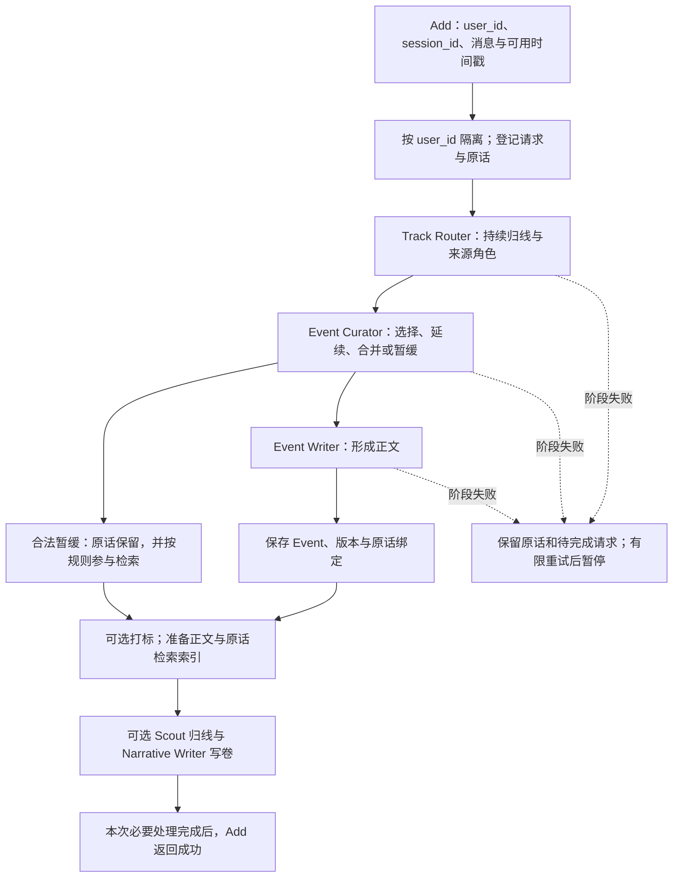
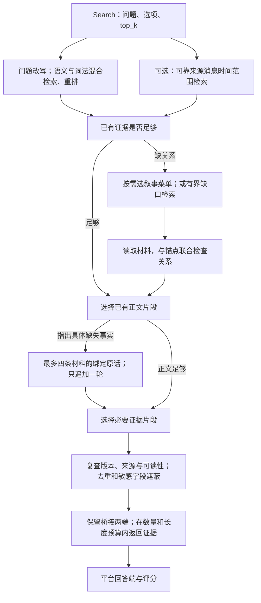
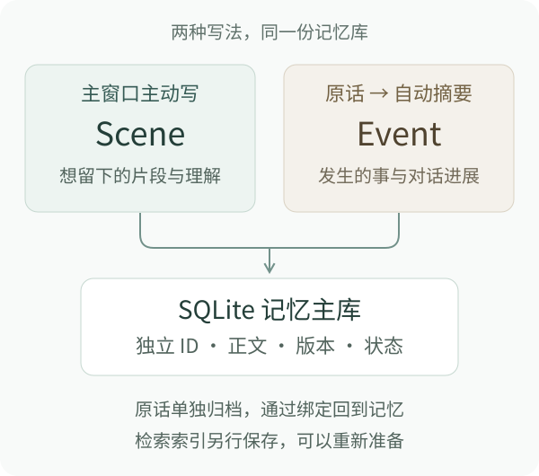
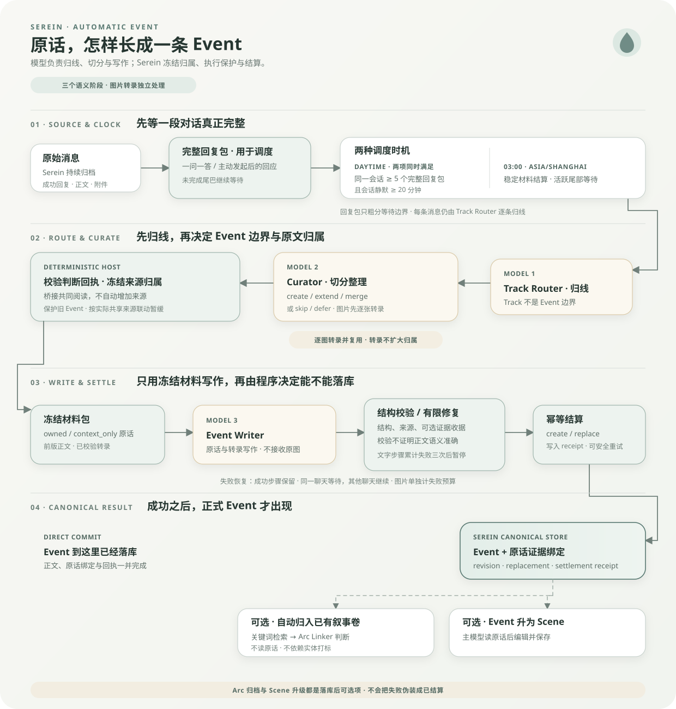
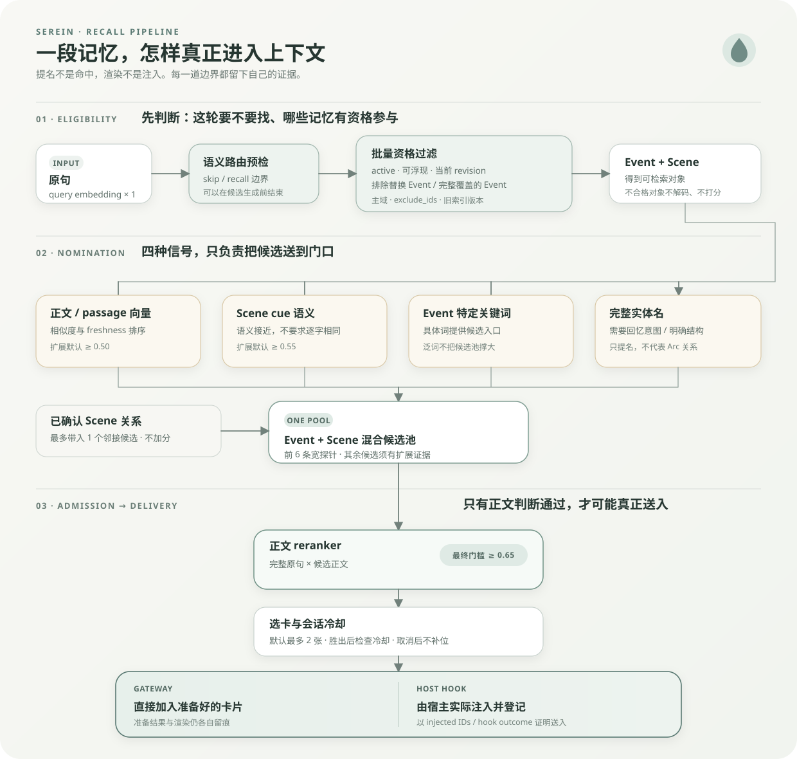

# Serein-AML 的保存与检索流程

本页描述比赛版代码 `105802b` 中的路径。功能开关决定哪些可选步骤运行；接口接收 Add 历史和 Search 问题，返回证据，由平台固定的回答端生成答案和评分。它不运行日常聊天中的自动浮现与交付冷却。

## Add：原话怎样成为记忆

Track 是话题组织线索，Event 是有正文和来源的记忆；一次 session 不等于一条 Event。叙事材料目录将已有记忆组织起来，但不保证覆盖所有经历。Scene 可以参与混合检索，比赛 Add 不会为了同一份材料固定再造一条 Scene。

## Search：已有材料怎样被找到、读全、交出去

新版可选证据路径由 `SEREIN_AML_SOURCE_EVIDENCE=1` 开启。程序给可见句子编号，模型选择编号，程序取回原句；不要求模型重新抄写支持句。模型仍负责判断相关性、缺口和关系，编号有效不等于语义正确。具体设计见[编号引用迁移说明](../NUMBERED_EVIDENCE_NOTES.md)。

例如 session A 的 Event 记“人物加入机构”，session B 的 Event 记“机构位于城市”。问题先命中 A，再从叙事菜单找到 B，最终保留两条关系事实及各自出处。是否需要原话，取决于正文是否已提供必要关系；原话仍会在本地参与绑定和可读性核验，不代表默认送给模型。

可靠的消息日期用于有界补召回，它不是完整的事件发生时间索引。没有题目给定的时间参照时不使用服务器“今天”补造参照。截断、缺失材料或语义判断错误仍可能造成漏召回；返回局部证据不等于完成全历史综合。

## 公开版设计图

以下图保留公开版的设计语境，供理解 Scene、Event、归线和日常召回；不要把其中所有步骤视为 AML 评测项目。

### 正文、原话与存储

### 自动 Event 整理

### 日常自动召回

AML 使用明确问题的 lookup 路径。上图中的日常自动浮现、冷却与宿主实际交付不由 AML Search 独立评测。

## 论文与比赛版的关系

[论文及配套材料](paper/README.md)报告持续归线、延迟结算和来源追溯的系统案例。正文、历史实验计数与图表保持公开阅读版原样；它不包含此次 AML 分数，也不能替代比赛的独立验收。

| 项目 | 论文／公开版语境 | AML 当前适配 |
| --- | --- | --- |
| Event 形成 | 持续归线、来源归属、写作与后续修订 | 复用公开管线，按 Add 的同步完成契约组织 |
| 编辑与引用审查 | 按文中历史版本与执行条件说明 | mini 使用简化任务；部分编辑门禁关闭，来源和保存契约保留 |
| 证据引用 | 文中保留各次实验的原有协议 | 可选查询路径用句子编号，程序恢复原句 |
| 自动浮现与冷却 | 面向持续聊天的使用机制 | Search 显式 lookup，不评测日常提起时机与交付冷却 |
| 叙事卷、窗影和全历史 | 不同用途与覆盖范围 | 有界菜单与材料读取不等于窗影接入或穷尽全历史 |
| 实验结论 | E1–E10 各自条件下的案例 | 不改写为 AML 成绩，不宣称组件贡献已独立测定 |

文档导入版本单独记录在 [`upstream-serein.json`](../upstream-serein.json)，不改变其中固定的后端基线。仅复制已在公开仓库跟踪的阅读文件；不附带运行库、原始评测问题、私有研究包或模型凭据。
